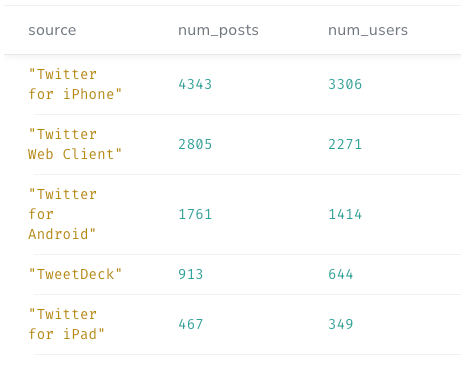
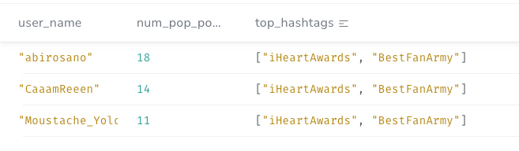
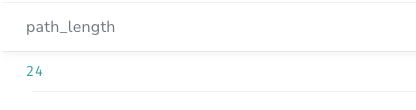
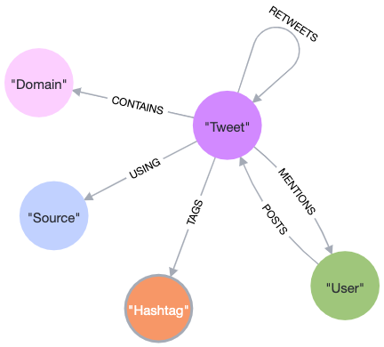
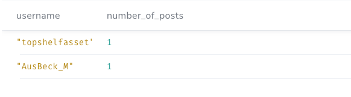
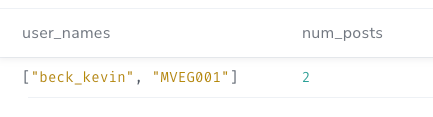
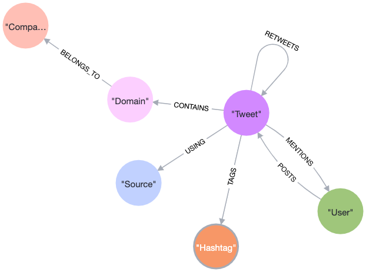

Nottachat Kaewgard

Student ID: 47369833

Macquarie University

# PART 1. Initial Graph Data Model

## Data Structure

Mapping Graph Data's Node to JSON attributes
- Tweet - JSON document
- Link - twitter_entities.urls[]
- Source - generator
- Hashtags - twitter_entities.hashtags[]
- User (POSTS) - actor
- User (Mentions) - twitter_entities.user_mentions[]

## Import Tweets

```
CALL apoc.periodic.iterate(
'CALL apoc.load.json("https://raw.githubusercontent.com/melbreaker/Neo4j-Tweet-Graph-Data-Model/main/cleaned_tweets.json") YIELD value',
'WITH
 value.id AS id,
 datetime({ epochMillis: apoc.date.parse(value.postedTime, "ms",
 "yyyy-MM-dd\'T\'HH:mm:ss.SSS\'Z\'")}) AS postedTimestamp,
 value.text AS text,
 value.twitter_lang AS language,
 value.retweetCount AS retweetCount,
 value.favoritesCount AS favoritesCount,
 value.verb AS verb
 MERGE (t:Tweet{id:id})
 ON CREATE SET\
 t.postedTimestamp = postedTimestamp,
 t.text = text,
 t.language = language,
 t.retweetCount = retweetCount,
 t.favoritesCount = favoritesCount,
 t.type = verb
',
{batchSize:500})
YIELD * ;
```

## Import Links

```
CALL apoc.periodic.iterate(
'CALL apoc.load.json("https://raw.githubusercontent.com/melbreaker/Neo4j-Tweet-Graph-Data-Model/main/cleaned_tweets.json") YIELD value',
'WITH
 value.id AS id,
 value.twitter_entities.urls AS urls
 WHERE size(urls) > 0 //filter for a tweet with urls
 MATCH(t:Tweet{id:id})
 UNWIND urls AS tw_url
 MERGE (l:Link{expanded_url: tw_url.expanded_url})
 ON CREATE SET
 l.url = tw_url.url,
 l.display_url = tw_url.display_url
 MERGE (t)-[:CONTAINS]->(l)',
{batchSize:500})
YIELD * ;
```

## Import Sources

```
CALL apoc.periodic.iterate(
'CALL apoc.load.json("https://raw.githubusercontent.com/melbreaker/10000_tweet/main/tweets.json") YIELD value',
'WITH
 value.id AS id,
 value.generator.displayName AS displayName,
 value.generator.link as link
 MATCH(t:Tweet{id:id})
 MERGE (s:Source{displayName: displayName, link: link})
 MERGE (t)-[:USING]->(s)
',
{batchSize:500})
YIELD * ;
```

## Import Hashtags

```
CALL apoc.periodic.iterate(
'CALL apoc.load.json("https://raw.githubusercontent.com/melbreaker/Neo4j-Tweet-Graph-Data-Model/main/cleaned_tweets.json") YIELD value',
'WITH
 value.id AS id,
 value.twitter_entities.hashtags AS hashtags
 WHERE size(hashtags) > 0 // filter for a tweet with hashtags
 MATCH(t:Tweet{id:id})
 UNWIND hashtags AS hashtag
 MERGE (h:Hashtag{text: hashtag.text})
 MERGE (t)-[:TAGS]->(h)',
{batchSize:500})
YIELD * ;
```

## Import Users 

**We cannot use User ID as a reliable identifier for users because, in user_mentions, the ID of the same user is abbreviated. Creating a unique user based on this abbreviated ID would lead to duplicate users with the same username. To import users, it's more preferable to use their usernames as identifiers since usernames are inherently unique.**

For example, a user with username "Dubagee" posted and is mentioned in several tweets. The difference is in User's ID as shown in the following: 

JSON documents for User who posted the tweet.
```
"object" : {
        "id" : "149715691054696161280",
        "actor" : {
            "objectType" : "person",
            "id" : "10243240798647", // User's ID
            "link" : "http://www.twitter.com/Dubagee",
            "displayName" : "Geneviève (GiGi)",
            ...
            "preferredUsername" : "Dubagee",
```

JSON documents for User who is mentioned.
```
"user_mentions" : [ 
            {
                "screen_name" : "Dubagee",
                "name" : "Geneviève (GiGi)",
                "id" : 240798647, // User's ID
                "id_str" : "240798647",
                "indices" : [ 
                    3, 
                    11
                ]
            }
```

## Import Users with a POSTS relationship

```
CALL apoc.periodic.iterate(
'CALL apoc.load.json("https://raw.githubusercontent.com/melbreaker/Neo4j-Tweet-Graph-Data-Model/main/cleaned_tweets.json") YIELD value',
'WITH
 value.id AS id,
 value.actor.id AS userId,
 value.actor.displayName AS displayName,
 value.actor.preferredUsername AS username
 MATCH (t:Tweet{id:id})
 MERGE (u:User{username: username})
 ON CREATE SET
 u.id = userId,
 u.displayName = displayName
 MERGE (u)-[:POSTS]->(t)',
{batchSize:500})
YIELD * ;
```

## Import Users with a MENTIONS relationship

```
CALL apoc.periodic.iterate(
'CALL apoc.load.json("https://raw.githubusercontent.com/melbreaker/Neo4j-Tweet-Graph-Data-Model/main/cleaned_tweets.json") YIELD value',
'WITH
 value.id AS id,
 value.twitter_entities.user_mentions AS userMentions
 WHERE size(userMentions) > 0 // filter for a tweet with mentioned users
 MATCH (t:Tweet{id:id})
 UNWIND userMentions AS userMention
 MERGE (u:User{username: userMention.screen_name})
 ON CREATE SET
 u.id = userMention.id_str, 
 u.displayName = userMention.name 
 MERGE (t)-[:MENTIONS]->(u)',
{batchSize:500})
YIELD * ;
```

## Import Original Tweet (A Tweet that is retweeted)

```
CALL apoc.periodic.iterate(
'CALL apoc.load.json("https://raw.githubusercontent.com/melbreaker/Neo4j-Tweet-Graph-Data-Model/main/cleaned_tweets.json") YIELD value',
'WITH
 value.id AS id,
 value.verb AS verb,
 value.object.id AS originalTweetId,
 datetime({ epochMillis: apoc.date.parse(value.object.postedTime, "ms",
 "yyyy-MM-dd\'T\'HH:mm:ss.SSS\'Z\'")}) AS postedTimestamp,
 value.object.text AS text,
 value.object.twitter_lang AS language,
 value.object.favoritesCount AS favoritesCount
 WHERE verb = "share" // filter for retweet
 MATCH(t1:Tweet{id: id, type: "share"}) 
 MERGE(t2:Tweet{id:originalTweetId}) 
 ON CREATE SET
 t2.postedTimestamp = postedTimestamp,
 t2.text = text,
 t2.language = language,
 t2.favoritesCount = favoritesCount,
 t2.type = "post"
 MERGE (t1)-[:RETWEETS]->(t2)
',
{batchSize:500})
YIELD *;
```

## Import Original Tweet's Links

```
CALL apoc.periodic.iterate(
'CALL apoc.load.json("https://raw.githubusercontent.com/melbreaker/Neo4j-Tweet-Graph-Data-Model/main/cleaned_tweets.json") YIELD value',
'WITH
 value.id AS id,
 value.object.twitter_entities.urls AS urls, 
 value.object.id AS originalTweetId,
 value.verb AS verb
 WHERE verb = "share" AND size(urls) > 0 // filter for a retweet with urls in the original tweet
 MATCH(t1:Tweet{id: id, type: "share"})
 MATCH(t2:Tweet{id: originalTweetId})
 UNWIND urls AS tw_url
 MERGE (l:Link{url: tw_url.url})
 ON CREATE SET
 l.expanded_url = tw_url.expanded_url,
 l.display_url = tw_url.display_url
 MERGE (t2)-[:CONTAINS]->(l)',
{batchSize:500})
YIELD * ;
```

## Import Original Tweet's Sources

```
CALL apoc.periodic.iterate(
'CALL apoc.load.json("https://raw.githubusercontent.com/melbreaker/Neo4j-Tweet-Graph-Data-Model/main/cleaned_tweets.json") YIELD value',
'WITH
 value.object.id AS originalTweetId,
 value.object.generator.displayName AS displayName,
 value.object.generator.link as link,
 value.verb AS verb
 WHERE verb = "share" // filter for retweet
 MATCH (t:Tweet{id: originalTweetId})
 MERGE (s:Source{displayName: displayName, link: link})
 MERGE (t)-[:USING]->(s)
',
{batchSize:500})
YIELD * ;
```

## Import Original Tweet's Hashtags

```
CALL apoc.periodic.iterate(
'CALL apoc.load.json("https://raw.githubusercontent.com/melbreaker/Neo4j-Tweet-Graph-Data-Model/main/cleaned_tweets.json") YIELD value',
'WITH
 value.object.id AS originalTweetId,
 value.object.twitter_entities.hashtags AS hashtags,
 value.verb AS verb
 WHERE verb = "share" AND size(hashtags) > 0 // filter for a retweet with hashtags in the original tweet
 MATCH(t:Tweet{id:originalTweetId})
 UNWIND hashtags AS hashtag
 MERGE (h:Hashtag{text: hashtag.text})
 MERGE (t)-[:TAGS]->(h)',
{batchSize:500})
YIELD * ;
```

## Import Original Tweet's Users with a POST relationship

```
CALL apoc.periodic.iterate(
'CALL apoc.load.json("https://raw.githubusercontent.com/melbreaker/Neo4j-Tweet-Graph-Data-Model/main/cleaned_tweets.json") YIELD value',
'WITH
 value.object.id AS originalTweetId,
 value.object.actor.id AS userId,
 value.object.actor.displayName AS displayName,
 value.object.actor.preferredUsername AS username,
 value.verb AS verb
 WHERE verb = "share" // filter for retweet
 MATCH (t:Tweet{id:originalTweetId})
 MERGE (u:User{username: username})
 ON CREATE SET
 u.id = userId,
 u.displayName = displayName
 MERGE (u)-[:POSTS]->(t)',
{batchSize:500})
YIELD * ;
```

## Import Original Tweet's Users with a MENTIONED relationship

```
CALL apoc.periodic.iterate(
'CALL apoc.load.json("https://raw.githubusercontent.com/melbreaker/Neo4j-Tweet-Graph-Data-Model/main/cleaned_tweets.json") YIELD value',
'WITH
 value.object.id AS originalTweetId,
 value.object.twitter_entities.user_mentions AS userMentions,
 value.verb AS verb
 WHERE verb = "share" AND size(userMentions) > 0 // filter for a retweet with mentioned users in the original tweet
 MATCH (t:Tweet{id:originalTweetId})
 UNWIND userMentions AS userMention
 MERGE (u:User{username: userMention.screen_name})
 ON CREATE SET
 u.id = userMention.id_str, 
 u.displayName = userMention.name
 MERGE (t)-[:MENTIONS]->(u)',
{batchSize:500})
YIELD * ;
```

# PART 2. Initial Queries

## Problem 1

*Find the top five most used sources (app or site) to post or share a tweet. For each source return the number of posts and the number of users that created tweets from that source.*

```
MATCH (s:Source)<-[r:USING]-(t:Tweet)<-[p:POSTS]-(u:User) 
RETURN s.displayName AS source, count(t) AS num_posts, count(DISTINCT u) AS num_users 
ORDER BY num_posts DESC LIMIT 5;
```


## Problem 2

*Find top 3 users that have the highest number of tweets with a retweetCount greater than 50. For each of these users show the number of popular tweets they have and the top 2 hashtags present in all their tweets in order of occurrence.*

```
MATCH (u:User)-[p:POSTS]->(t:Tweet)-[r:TAGS]->(h:Hashtag) 
WHERE t.retweetCount > 50
WITH u.username AS user_name, COUNT(DISTINCT t) AS num_pop_posts, COLLECT(DISTINCT h.text) AS hashtags
RETURN user_name, num_pop_posts, REDUCE(s = [], h IN hashtags | CASE WHEN SIZE(s) < 2 THEN s + h ELSE s END) AS top_hashtags 
ORDER BY num_pop_posts DESC LIMIT 3;
```


## Problem 3

*Find the shortest path connecting the User ‘luckyinsivan’ and the hashtag ‘imsosick’ using any relationship type except :USING. Submit a picture of the path from neo4j browser graph view and the length of this path.*

```
MATCH p=shortestPath((u:User{username: "luckyinsivan"})-[r:CONTAINS|MENTIONS|POSTS|RETWEETS|TAGS*]-(h:Hashtag{text: "imsosick"})) 
RETURN length(p) as path_length;
```


# PART 3: Refactoring the Model

## Problem A

*Suggest a modification to the base data model shown in Figure 3, that would make it easier to answer questions such as “Show me the top 5 users posting links from realestate.com.au”. Discuss any other options you considered.*

To improve the data model for answering such question, the following modifications are considered:

1. Introduce Domain Nodes: Create a separate Domain node for each unique domain (e.g., realestate.com.au) that appears in the expanded URLs. Each Domain node should have a property to store the domain name.

2. Relationship Between Tweet and Domain: Establish a relationship "CONTAINS" between Tweet nodes and Domain nodes to indicate that a Tweet contains a link from a specific domain. The relationship should have a property to store the expanded URLs.

3. Eliminate the current Link node: As the relationship between Domain and Tweet already holds the information regarding expanded URLs, deleting the existing Link node and its associated relationships will eliminate data redundancy.

By implementing this modification, it is more efficient to answer questions related to specific domains because it allows direct traversal of relationship between Tweet nodes and Domain nodes without having to compare part of URL string in the expanded_url property.



### Domain Node

| Property | Value               |
|----------|---------------------|
| name     | "realestate.com.au" |

### CONTAINS Relationship

| Property     | Value                      |
|--------------|----------------------------|
| display_url  | "realestate.com.au"        |
| expanded_url | "http://realestate.com.au" |
| url          | "https://t.co/U1itzJzgpZ"  |

Originally, to find the top 5 users posting links from realestate.com.au, the cypher will be like this
```
MATCH (u:User)-[p:POSTS]->(t:Tweet)-[c:CONTAINS]->(l:Link) 
WHERE l.expanded_url CONTAINS "realestate.com.au" 
RETURN u.username as username, count(distinct t) as number_of_posts
ORDER BY number_of_posts DESC
LIMIT 5;
```


An updated cypher with a direct traversal of relationship between User, Tweet and Domain nodes
```
MATCH (u:User)-[p:POSTS]->(t:Tweet)-[c:CONTAINS]->(d:Domain {name: "realestate.com.au"}) 
RETURN u.username as username, count(distinct t) as number_of_posts 
ORDER BY number_of_posts DESC
LIMIT 5;
```

## Problem B

*Write the Cypher statements to implement your changes to the model. This should process existing data in the model to create new nodes and relationships from the data you already have.*

### Create Domain nodes and relationships to Tweet nodes. 

The script uses apoc.data.url() to extract domain name from the URLs.
```
MATCH (tweet:Tweet)-[:CONTAINS]->(link:Link) 
WITH *, apoc.data.url(link.expanded_url) as url 
MERGE (domain:Domain {name: url.host})
MERGE (tweet)-[c:CONTAINS]->(domain)
ON CREATE SET 
c.expanded_url = link.expanded_url,
c.display_url = link.display_url,
c.url = link.url;
```
### Delete existing Link nodes and it's relationships
```
MATCH (link:Link) DETACH DELETE link;
```

## Problem C

*Using elements of your extended data model, answer the following question with a Cypher query. Which user(s) post the most links from linkedin, that is links from the domain "www.linkedin.com" or "lnkd.in"*

```
MATCH (u:User)-[p:POSTS]->(t:Tweet)-[c:CONTAINS]->(d:Domain) 
WHERE d.name = "www.linkedin.com" OR d.name = "lnkd.in" 
WITH u.username as username, count(distinct t) as num_posts 
ORDER BY toLower(username)
RETURN collect(username) as user_names, num_posts
ORDER BY num_posts DESC
LIMIT 1;
```


## Problem D

*In part C, we can see that an organisation might have multiple domains associated with it. Can you design a model to also allow for this so the query in Part C could be just focused on the company linkedin itself. We would also like to able to use the graph to analyse these links by industry, extend the model again to allow for this.*

To accommodate multiple domains associated with a company and to facilitate focused queries on a specific company like LikedIn, as well as enable link analysis by industry, the model is purposed with the following model enhancements:

1. Introduce Company nodes: Create a separate node for each unique company (e.g. LinkIn). Each Company node should store company essential properties such as name and industry.

2. Relationship between Company and Tweet: Establish a relationship named "CONTAINS" between Company nodes and Tweet nodes to indicate that a Tweet contains a link from a specific Company. The relationship should store  domain and expanded URLs properties.

By implementing these modifications, it is more efficient to answer questions related to specific company or industry because it allows direct traversal of relationship between Tweet nodes and Company nodes. Additionally, we retrain important information such as domain names and expanded URLs within the relationship properties, which will facilitate future link analysis based on specific URLs.




### Company Node

| Property | Value          |
|----------|----------------|
| name     | "LinkedIn"     |
| industry | "Social Media" |


## CONTAINS Relationship

| Property     | Value                     |
|--------------|---------------------------|
| domain       | "lnkd.in"                 |
| display_url  | "lnkd.in/bNS5EUW"         |
| expanded_url | "https://lnkd.in/bNS5EUW" |
| url          | "https://t.co/jB2No9qJWJ" |