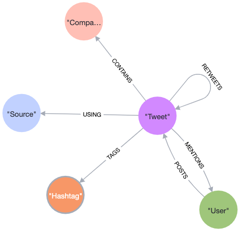

## Data Structure
- Link - twitter_entities.urls
- Source - generator
- Hashtags - twitter_entities.hashtags
- User (POSTS) - actor
- User (Mentions) - twitter_entities.user_mentions

# PART 1

## Import Tweets

```
CALL apoc.periodic.iterate(
'CALL apoc.load.json("https://raw.githubusercontent.com/melbreaker/10000_tweet/main/tweets.json") YIELD value',
'WITH
 value.id AS id,
 datetime({ epochMillis: apoc.date.parse(value.postedTime, "ms",
 "yyyy-MM-dd\'T\'HH:mm:ss.SSS\'Z\'")}) AS postedTimestamp,
 value.text AS text,
 value.twitter_lang AS language,
 value.retweetCount AS retweetCount,
 value.favoritesCount AS favoritesCount,
 value.verb AS verb
 MERGE (t:Tweet{id:id})
 ON CREATE SET\
 t.postedTimestamp = postedTimestamp,
 t.text = text,
 t.language = language,
 t.retweetCount = retweetCount,
 t.favoritesCount = favoritesCount,
 t.type = verb
',
{batchSize:500})
YIELD * ;
```

## Import Links

```
CALL apoc.periodic.iterate(
'CALL apoc.load.json("https://raw.githubusercontent.com/melbreaker/10000_tweet/main/tweets.json") YIELD value',
'WITH
 value.id AS id,
 value.twitter_entities.urls AS urls
 MATCH(t:Tweet{id:id})
 UNWIND urls AS tw_url
 MERGE (l:Link{url: tw_url.url})
 ON CREATE SET
 l.expanded_url = tw_url.expanded_url,
 l.display_url = tw_url.display_url
 MERGE (t)-[:CONTAINS]->(l)',
{batchSize:500})
YIELD * ;
```

## Import Sources

```
CALL apoc.periodic.iterate(
'CALL apoc.load.json("https://raw.githubusercontent.com/melbreaker/10000_tweet/main/tweets.json") YIELD value',
'WITH
 value.id AS id,
 value.generator.displayName AS displayName,
 value.generator.link as link
 MATCH(t:Tweet{id:id})
 MERGE (s:Source{displayName: displayName, link: link})
 MERGE (t)-[:USING]->(s)
',
{batchSize:500})
YIELD * ;
```

## Import Hashtags

```
CALL apoc.periodic.iterate(
'CALL apoc.load.json("https://raw.githubusercontent.com/melbreaker/10000_tweet/main/tweets.json") YIELD value',
'WITH
 value.id AS id,
 value.twitter_entities.hashtags AS hashtags
 MATCH(t:Tweet{id:id})
 UNWIND hashtags AS hashtag
 MERGE (h:Hashtag{text: hashtag.text})
 MERGE (t)-[:TAGS]->(h)',
{batchSize:500})
YIELD * ;
```

## Import Users (POSTS)

```
CALL apoc.periodic.iterate(
'CALL apoc.load.json("https://raw.githubusercontent.com/melbreaker/10000_tweet/main/tweets.json") YIELD value',
'WITH
 value.id AS id,
 value.actor.id AS userId,
 value.actor.displayName AS displayName,
 value.actor.preferredUsername AS username
 MATCH (t:Tweet{id:id})
 MERGE (u:User{username: username})
 ON CREATE SET
 u.id = userId,
 u.displayName = displayName
 MERGE (u)-[:POSTS]->(t)',
{batchSize:500})
YIELD * ;
```

## Import Users (Mentions)

```
CALL apoc.periodic.iterate(
'CALL apoc.load.json("https://raw.githubusercontent.com/melbreaker/10000_tweet/main/tweets.json") YIELD value',
'WITH
 value.id AS id,
 value.twitter_entities.user_mentions AS userMentions
 MATCH (t:Tweet{id:id})
 UNWIND userMentions AS userMention
 MERGE (u:User{username: userMention.screen_name})
 ON CREATE SET
 u.id = userMention.id_str, 
 u.displayName = userMention.name 
 MERGE (t)-[:MENTIONS]->(u)',
{batchSize:500})
YIELD * ;
```

## Import Retweet

```
CALL apoc.periodic.iterate(
'CALL apoc.load.json("https://raw.githubusercontent.com/melbreaker/10000_tweet/main/tweets.json") YIELD value',
'WITH
 value.id AS id,
 value.verb AS verb,
 value.object.id AS originalTweetId,
 datetime({ epochMillis: apoc.date.parse(value.object.postedTime, "ms",
 "yyyy-MM-dd\'T\'HH:mm:ss.SSS\'Z\'")}) AS postedTimestamp,
 value.object.text AS text,
 value.object.twitter_lang AS language,
 value.object.favoritesCount AS favoritesCount
 MATCH(t1:Tweet{id: id, type: "share"}) 
 MERGE(t2:Tweet{id:originalTweetId}) 
 ON CREATE SET
 t2.postedTimestamp = postedTimestamp,
 t2.text = text,
 t2.language = language,
 t2.favoritesCount = favoritesCount,
 t2.type = "post"
 MERGE (t1)-[:RETWEETS]->(t2)
',
{batchSize:500})
YIELD *;
```

## Import Links (Retweet)

```
CALL apoc.periodic.iterate(
'CALL apoc.load.json("https://raw.githubusercontent.com/melbreaker/10000_tweet/main/tweets.json") YIELD value',
'WITH
 value.object.id AS originalTweetId,
 value.object.twitter_entities.urls AS urls
 MATCH(t:Tweet{id: originalTweetId})
 UNWIND urls AS tw_url
 MERGE (l:Link{url: tw_url.url})
 ON CREATE SET
 l.expanded_url = tw_url.expanded_url,
 l.display_url = tw_url.display_url
 MERGE (t)-[:CONTAINS]->(l)',
{batchSize:500})
YIELD * ;
```

## Import Sources (Retweet)

```
CALL apoc.periodic.iterate(
'CALL apoc.load.json("https://raw.githubusercontent.com/melbreaker/10000_tweet/main/tweets.json") YIELD value',
'WITH
 value.object.id AS originalTweetId,
 value.object.generator.displayName AS displayName,
 value.object.generator.link as link
 MATCH (t:Tweet{id: originalTweetId})
 MERGE (s:Source{displayName: displayName, link: link})
 MERGE (t)-[:USING]->(s)
',
{batchSize:500})
YIELD * ;
```

## Import Hashtags (Retweet)

```
CALL apoc.periodic.iterate(
'CALL apoc.load.json("https://raw.githubusercontent.com/melbreaker/10000_tweet/main/tweets.json") YIELD value',
'WITH
 value.object.id AS originalTweetId,
 value.object.twitter_entities.hashtags AS hashtags
 MATCH(t:Tweet{id:originalTweetId})
 UNWIND hashtags AS hashtag
 MERGE (h:Hashtag{text: hashtag.text})
 MERGE (t)-[:TAGS]->(h)',
{batchSize:500})
YIELD * ;
```

## Import Users - POSTS (Retweet)

```
CALL apoc.periodic.iterate(
'CALL apoc.load.json("https://raw.githubusercontent.com/melbreaker/10000_tweet/main/tweets.json") YIELD value',
'WITH
 value.object.id AS originalTweetId,
 value.object.actor.id AS userId,
 value.object.actor.displayName AS displayName,
 value.object.actor.preferredUsername AS username
 MATCH (t:Tweet{id:originalTweetId})
 MERGE (u:User{username: username})
 ON CREATE SET
 u.id = userId,
 u.displayName = displayName
 MERGE (u)-[:POSTS]->(t)',
{batchSize:500})
YIELD * ;
```

## Import Users - MENTIONS (Retweet)

```
CALL apoc.periodic.iterate(
'CALL apoc.load.json("https://raw.githubusercontent.com/melbreaker/10000_tweet/main/tweets.json") YIELD value',
'WITH
 value.object.id AS originalTweetId,
 value.object.twitter_entities.user_mentions AS userMentions
 MATCH (t:Tweet{id:originalTweetId})
 UNWIND userMentions AS userMention
 MERGE (u:User{username: userMention.screen_name})
 ON CREATE SET
 u.id = userMention.id_str, 
 u.displayName = userMention.name
 MERGE (t)-[:MENTIONS]->(u)',
{batchSize:500})
YIELD * ;
```

# PART 2

## Problem 1

```
MATCH (s:Source)<-[r:USING]-(t:Tweet)<-[p:POSTS]-(u:User) 
RETURN s.displayName AS source, count(t) AS num_posts, count(DISTINCT u) AS num_users 
ORDER BY num_posts DESC LIMIT 5;
```

## Problem 2

```
MATCH (u:User)-[p:POSTS]->(t:Tweet)-[r:TAGS]->(h:Hashtag) 
WHERE t.retweetCount > 50 
RETURN u.username AS user_name, COUNT(t) AS num_pop_posts, collect(DISTINCT h.text) AS top_hashtags 
ORDER BY num_pop_posts DESC LIMIT 3;
```

## Problem 3

```
MATCH p=allShortestPaths((u:User{username: "luckyinsivan"})-[r:CONTAINS|MENTIONS|POSTS|RETWEETS|TAGS*]-(h:Hashtag{text: "imsosick"})) 
RETURN length(p) as path_length LIMIT 1;
```

# PART 3: Refactoring the Model

## Problem A

*Suggest a modification to the base data model shown in Figure 3, that would make it easier to answer questions such as “Show me the top 5 users posting links from realestate.com.au”. Discuss any other options you considered.*

To improve the data model for answering such question, the following modifications are considered:

1. Introduce Domain Nodes: Create a separate Domain node for each unique domain (e.g., realestate.com.au) that appears in the expanded URLs. Each Domain node should have a property to store the domain name.

2. Relationship Between Tweet and Domain: Establish a relationship "CONTAINS" between Tweet nodes and Domain nodes to indicate that a Tweet contains a link from a specific domain. The relationship should have a property to store the expanded URLs.

3. Eliminate the current Link node: As the relationship between Domain and Tweet already holds the information regarding expanded URLs, deleting the existing Link node and its associated relationships will eliminate data redundancy.

By implementing this modification, it is more efficient to answer questions related to specific domains because it allows direct traversal of relationship between Tweet nodes and Domain nodes without having to compare part of URL string in the expanded_url property.

Originally, to find the top 5 users posting links from realestate.com.au, the cypher will be like this
```
MATCH (u:User)-[p:POSTS]->(t:Tweet)-[c:CONTAINS]->(l:Link) 
WHERE l.expanded_url CONTAINS "realestate.com.au" 
RETURN u.username as username, count(distinct t) as number_of_posts  ;
```

An updated cypher with a direct traversal of relationship between User, Tweet and Domain nodes
```
MATCH (u:User)-[p:POSTS]->(t:Tweet)-[c:CONTAINS]->(d:Domain {name: "realestate.com.au"}) 
RETURN u.username as username, count(distinct t) as number_of_posts  ;
```

## Problem B

*Write the Cypher statements to implement your changes to the model. This should process existing data in the model to create new nodes and relationships from the data you already have.*

### Create Domain nodes and relationships to Tweet nodes. 

The script use apoc.data.url() to extract domain name from the URLs.
```
MATCH (tweet:Tweet)-[:CONTAINS]->(link:Link) 
WITH *, apoc.data.url(link.expanded_url) as url 
MERGE (domain:Domain {name: url.host})
MERGE (tweet)-[c:CONTAINS]->(domain)
ON CREATE SET 
c.expanded_url = link.expanded_url,
c.display_url = link.display_url,
c.url = link.url;
```
### Delete existing Link nodes and it's relationships
```
MATCH (link:Link) DETACH DELETE link;
```

## Problem C

```
MATCH (u:User)-[p:POSTS]->(t:Tweet)-[c:CONTAINS]->(d:Domain) WHERE d.text = "www.linkedin.com" OR d.text = "lnkd.in" 
WITH u.username as username, count(distinct t) as num_posts
RETURN collect(username) as user_names, num_posts
ORDER BY num_posts DESC LIMIT 1;
```

## Problem D

